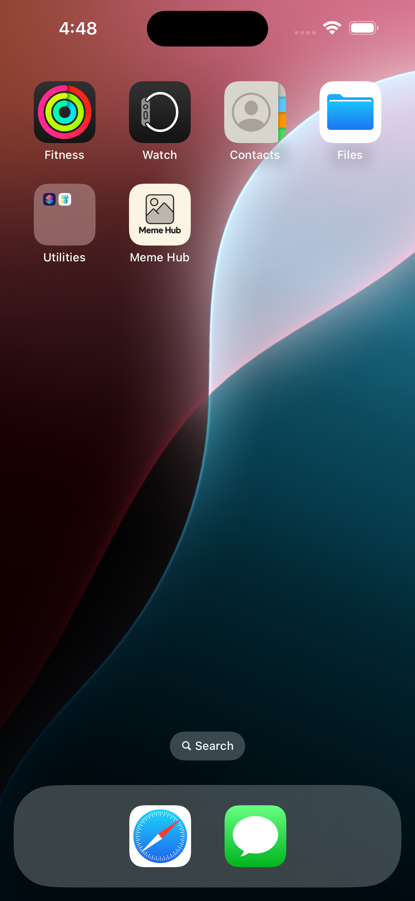
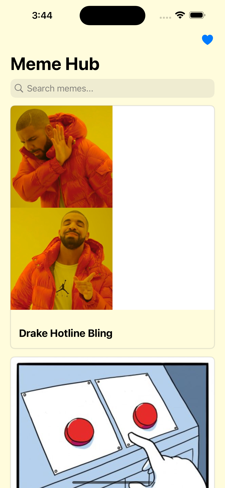
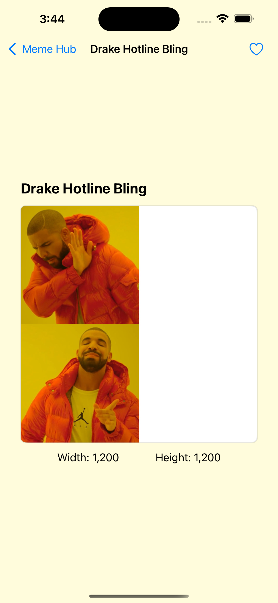
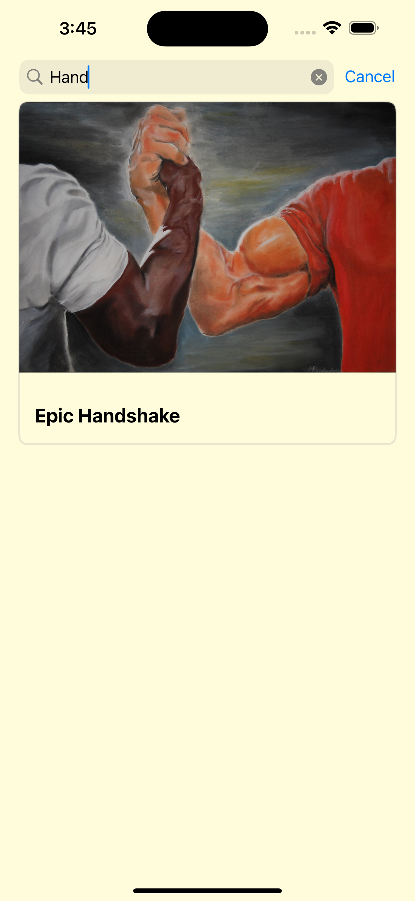
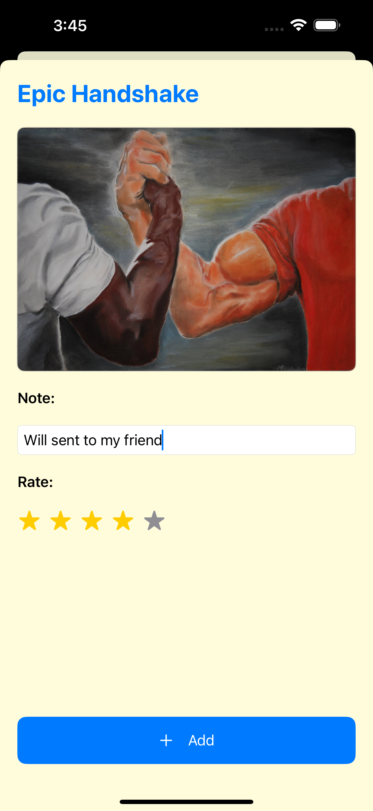
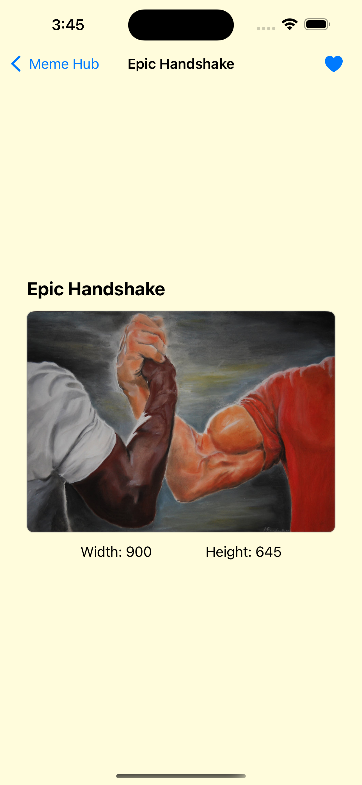
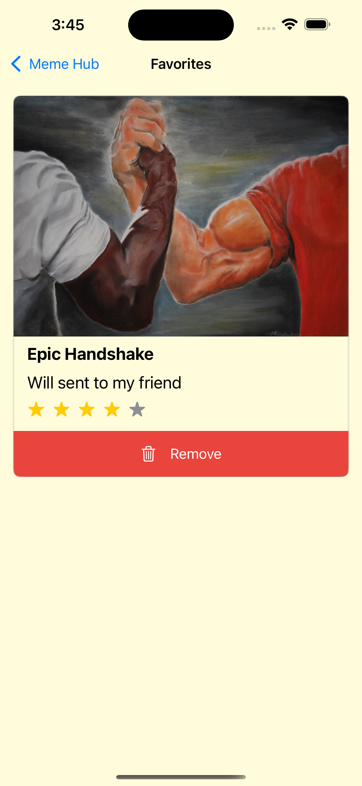

  <h1 align="center">🎭 Meme Hub – iOS</h1>

  
A simple and elegant SwiftUI Meme Hub app.
Part of my journey to <b>master mobile development</b> across Android, iOS, and cross-platform frameworks.

## 📱 Features

### 🌤️ Core Functionality

- **Dynamic Meme Display**: Fetch Memes from [**imgflip**](https://imgflip.com/api) API
- **Swift Data**: Save meme with note and rate, also ability to delete it

---

## 📸 App Screenshots

Explore the key features and interface of the app through the following screenshots and demo.

---

### 🧿 App Overview

<table>
  <tr>
    <td align="center">
      
       <b>🎞️ App Demo</b>
    </td>
    <td align="center">
      
       <b>📱 App Icon</b>
    </td>
  </tr>
</table>

---

### 🗂️ Core Features

<table>
  <tr>
    <td align="center">
      
       <b>🗃️ Meme List</b>
    </td>
    <td align="center">
      
       <b>📝 Meme Details</b>
    </td>
    <td align="center">
      
       <b>🔎 Search by Name</b>
    </td>
  </tr>
</table>

---

### ⭐ Favorites & Notes

<table>
  <tr>
    <td align="center">
      
       <b>🖊️ Add Note & Rate</b>
    </td>
    <td align="center">
      
       <b>📌 Saved to Favorites</b>
    </td>
    <td align="center">
      
       <b>❤️ Favorite Memes List</b>
    </td>
  </tr>
</table>

## 🎓 Course

Made as practice after finishing [**“iPhone Apps for Complete Beginners - Swift, SwiftUI & iOS17”**](https://www.udemy.com/course/iphone-apps-for-complete-beginners-make-ios-17-apps/?srsltid=AfmBOoq7IygRaO-ze5S9PzQpniFkcvjQ6WoOG2RyySveifhrBgs2zx_r&couponCode=2021PM25) course

📄 [View Certificate]()

---

⭐ If you found this helpful, please consider starring the repo!
